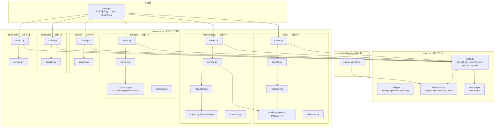

# 아키텍처 다이어그램 — 도메인 폴더 + 의존성 방향

Sprint 1 목표 구조. `core/`는 공통 인프라, `domains/*`는 비즈니스 도메인. 화살표는 의존 방향(→ 쪽이 의존 대상).

의존성 규칙 요약:
- `router` → `service` → `repository` → `models` (3레이어)
- `router` → `service` (2레이어, ORM 직접 접근)
- `domains/reservations/service` → `domains/auth/models` (User 타입 참조만, auth service에는 의존하지 않음)
- `core/*`는 어느 도메인에서도 import 가능하나, `domains/*`끼리는 최소화
