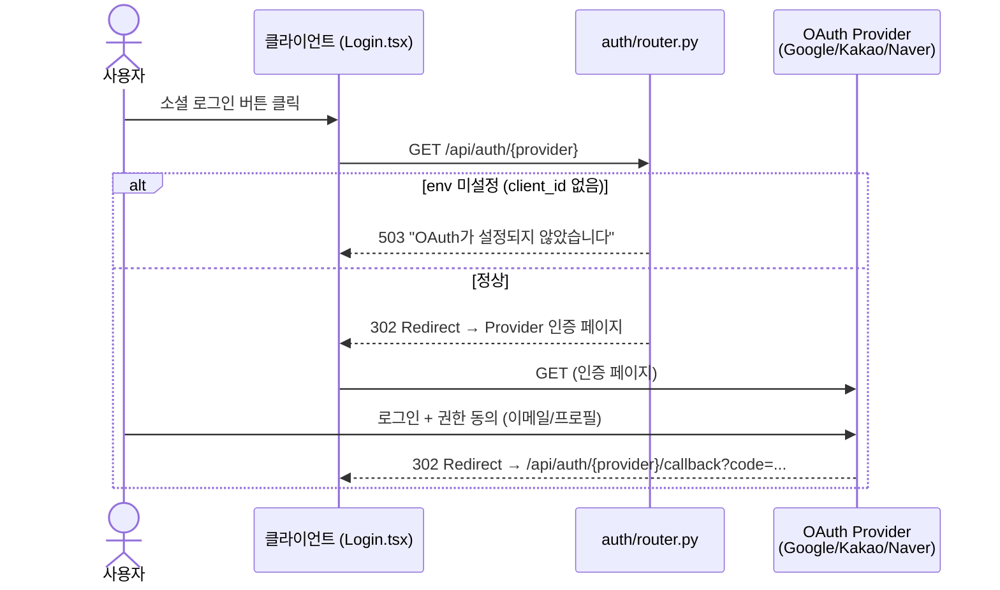
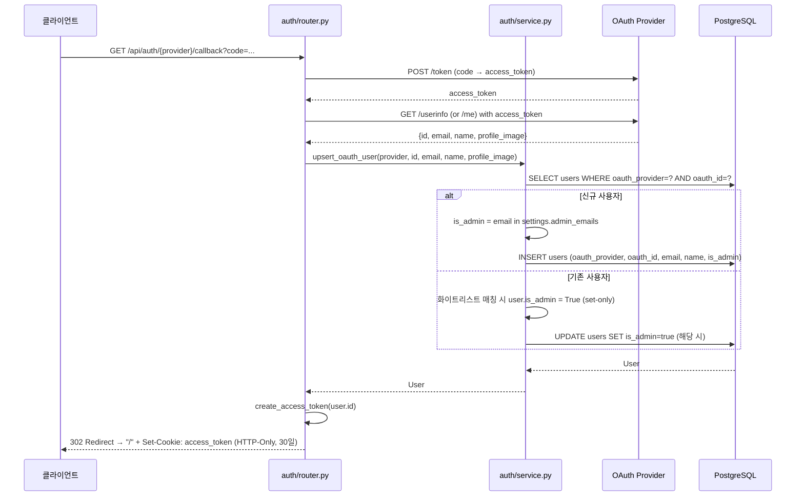
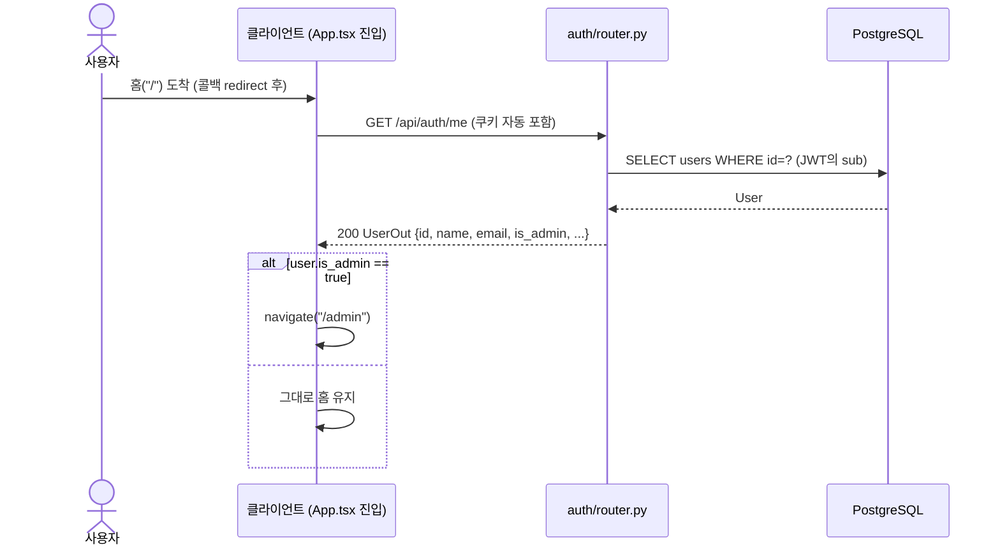

# 인증 흐름 — OAuth-only (PM-06 개편)

OAuth(Google/Kakao/Naver) 단일 흐름. 로컬 ID/PW·phone OTP는 폐기.

## 1단계 — OAuth 로그인 시작



## 2단계 — OAuth 콜백 + 관리자 자동 승격



## 3단계 — 페이지 진입 후 admin 분기



## 로그아웃

```mermaid
sequenceDiagram
    actor U as 사용자
    participant C as 클라이언트
    participant R as auth/router.py

    U->>C: 로그아웃 클릭
    C->>R: POST /api/auth/logout
    R-->>C: 200 {message} + Set-Cookie: access_token=; Max-Age=0
    C->>C: navigate("/")
```

## 관리자 식별 정책 (PM-06)

- `.env`의 `ADMIN_EMAILS` (콤마 구분, 예: `owner@example.com,partner@example.com`)
- 화이트리스트 매칭은 **OAuth 콜백마다** 실행 → 이메일이 화이트리스트에 늦게 추가되어도 다음 로그인부터 자동 승격
- **set-only**: 매칭되면 `is_admin=true`로 set, 비매칭이면 기존 값 유지 (강등 안 함)
- 카카오 OAuth는 Kakao Developers 콘솔에서 이메일 동의 항목을 켜둬야 매칭 가능

## 폐기된 흐름

- ~~로컬 ID/PW 회원가입~~ (`POST /api/auth/register`)
- ~~로컬 ID/PW 로그인~~ (`POST /api/auth/login`)
- ~~전화 OTP 발송/검증~~ (`POST /api/auth/phone/send`, `/verify`)
