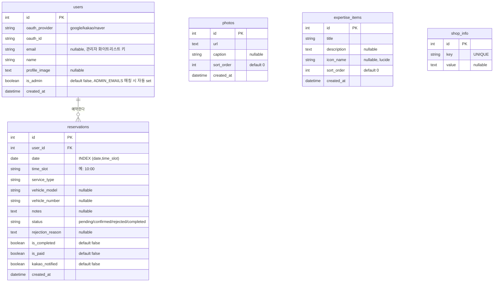

# ERD — 전체 테이블 관계도

Sprint 1 데이터 모델 (PM-06 OAuth-only 개편 반영). `users` 1:N `reservations`, 그 외 테이블은 독립 엔티티.

주요 인덱스 (Sprint 1 신규 추가):
- `ix_reservations_date_time` ON reservations(date, time_slot) — 시간대 충돌 체크 + 캘린더 조회
- `ix_reservations_user_date` ON reservations(user_id, date DESC) — 사용자별 예약 목록 조회
