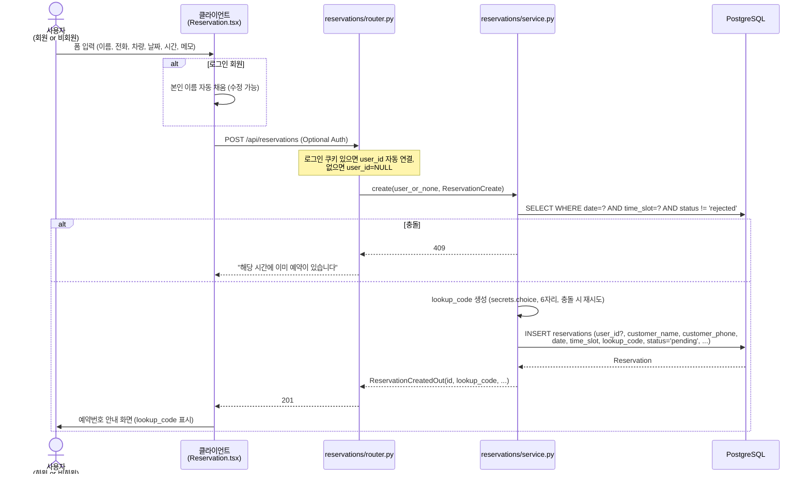
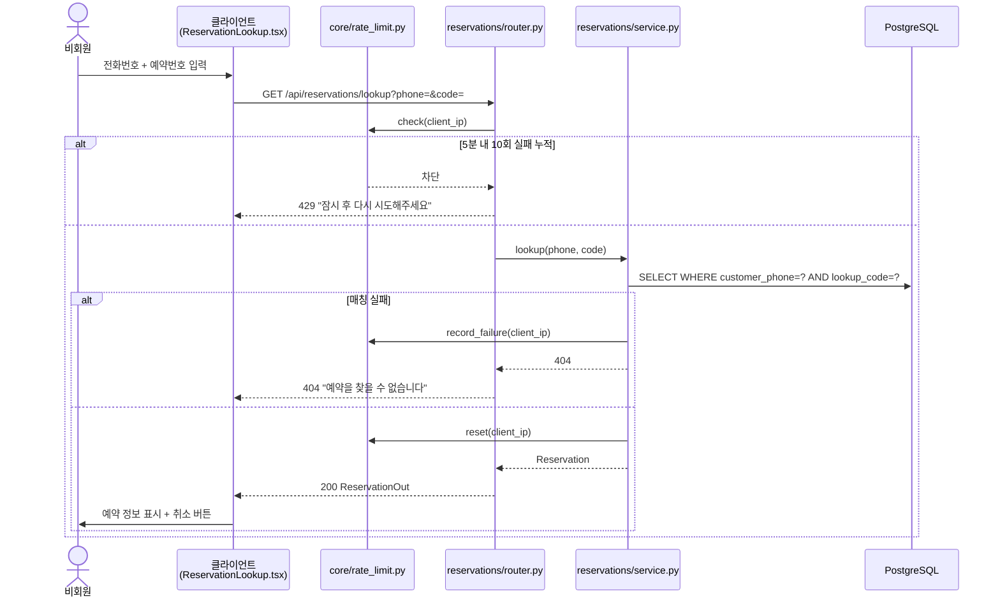
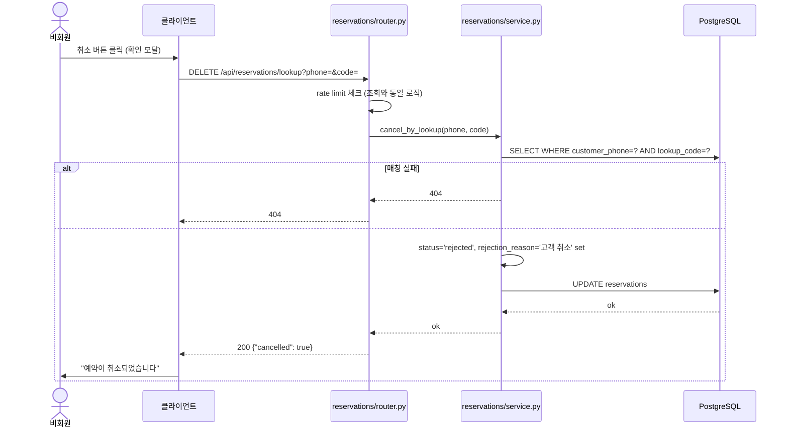

# 비회원 예약 + 조회/취소 흐름 (Sprint 2 / REQ-03)

회원/비회원이 동일한 폼으로 예약하고, 비회원은 전화번호+예약번호로 본인 예약을 조회·취소.

## 1단계 — 예약 생성 (회원/비회원 통합)

## 2단계 — 비회원 조회

## 3단계 — 비회원 취소 (soft delete)

## 데이터 정합성 정책 (PM-08)

| 케이스 | customer_name | customer_phone | user_id |
|:--|:--|:--|:--|
| 비회원 예약 | 폼 입력 | 폼 입력 | NULL |
| 회원 예약 (본인 정보로) | 폼 입력 (User.name 자동 채움) | 폼 입력 (수동 입력) | user.id |
| 회원 예약 (대리) | 폼 입력 (가족 이름) | 폼 입력 (가족 번호) | user.id |

회원이 폼에서 임의 수정해도 User 테이블 정보는 변경되지 않는다.

## 보안 정책

- `lookup_code`는 `secrets.choice` 사용. 헷갈리는 0/O/1/I/L 제외 (대문자 알파벳 + 숫자 약 30자 풀)
- IP 기반 rate limit은 lookup 조회/취소 두 엔드포인트에 공통 적용
- 비회원 취소는 soft delete (status='rejected') — 운영자가 이력 확인 가능
- FK ondelete=SET NULL — 회원 탈퇴 시에도 운영 이력 보존
