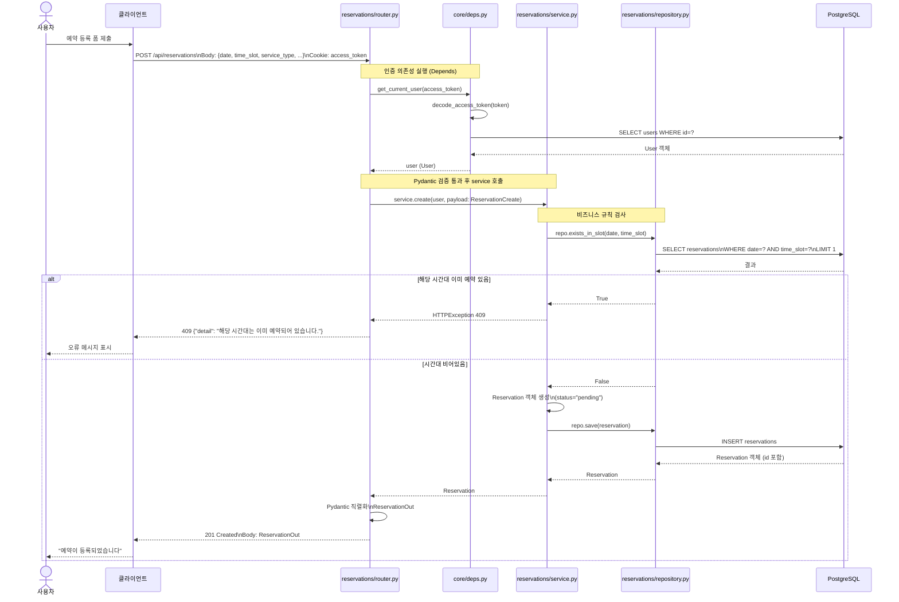

# 요청 처리 흐름 — POST /api/reservations (3레이어 예시)

한 요청이 router → service → repository를 거쳐 응답까지 처리되는 흐름.

레이어 책임 요약:
- `router.py`: HTTP 파싱, 인증 의존성(`Depends`), 응답 직렬화. `HTTPException`은 여기서만 발생
- `service.py`: 비즈니스 규칙(시간대 충돌 검사, 권한 검사). SQLAlchemy 세션 직접 접근 없음
- `repository.py`: SQLAlchemy 세션을 통한 DB 조회/저장. 비즈니스 로직 없음
