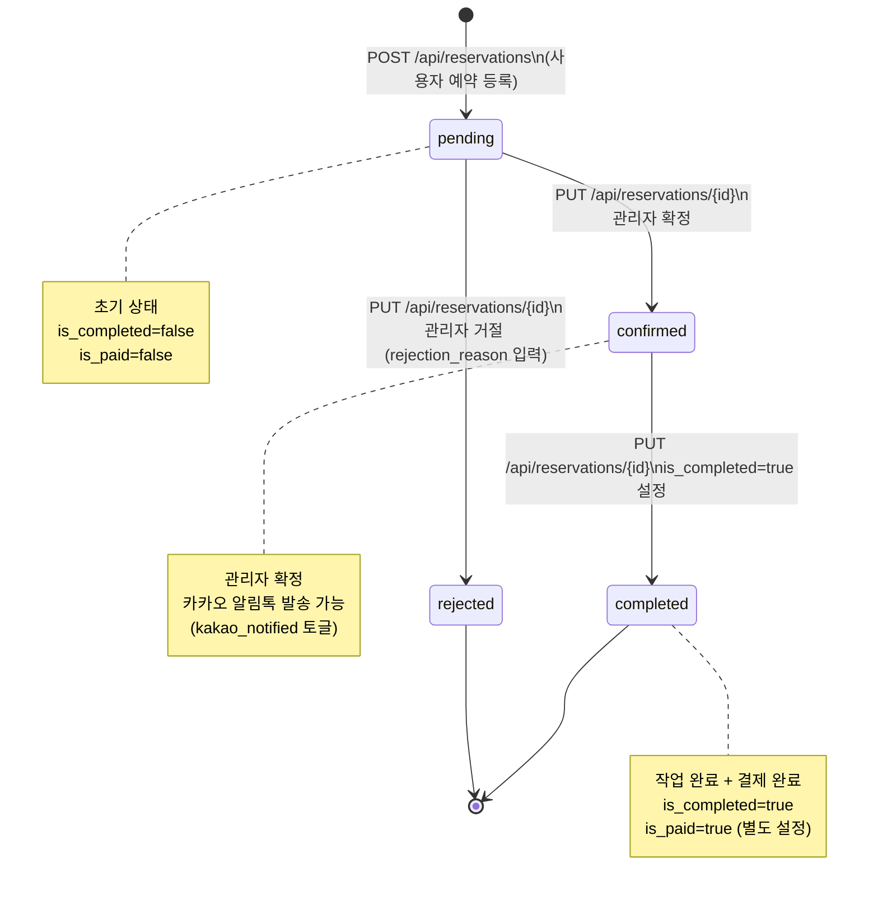

# 예약 상태 전이 다이어그램

`reservations.status` 컬럼의 허용 전이. service 레이어에서 강제한다.

상태 전이 규칙 (service에서 검증):
- `pending` → `confirmed` / `rejected`: 관리자만 가능
- `confirmed` → `completed`: 관리자만 가능
- 역방향 전이(예: `confirmed` → `pending`)는 허용하지 않는다
- `status`는 현재 `String(20)` 타입. ENUM 전환은 파킹랏 D-4 (다음 스프린트)
